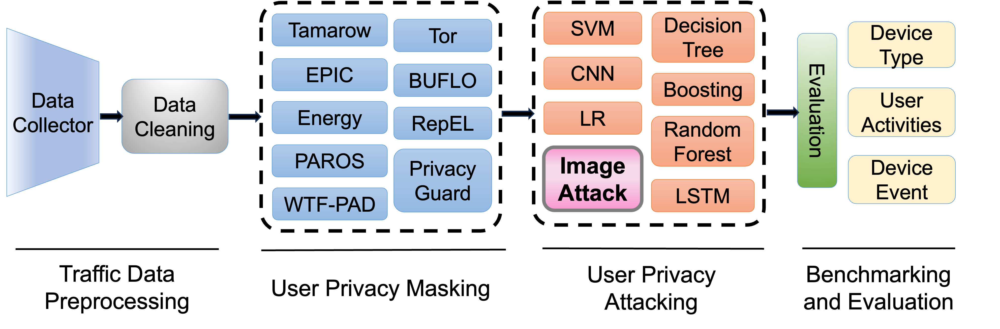

 

# 
I Still See You: Why Existing IoT Traffic Reshaping Fails

Su Wang, Keyang Yu, Qi Li, Dong Chen

Colorado School of Mines

 

In Proc. of the 21st International Conference on Embedded Wireless Systems and Networks (EWSN 2024).

 
The Internet traffic data produced by the Internet of Things (IoT) devices are collected by Internet Service Providers (ISPs) and device manufacturers, and often shared with their third parties to maintain and enhance user services. Unfortunately, on-path adversaries could infer and fingerprint users' sensitive privacy information such as occupancy and user activities by analyzing these network traffic traces. While there's a growing body of literature on defending against this side-channel attack---malicious IoT traffic analytics (TA), there's currently no systematic method to compare and evaluate the comprehensiveness of these existing studies. To address this problem, we design a new low-cost, open-source system framework---IoT Traffic Exposure Monitoring Toolkit (ITEMTK) that enables people to comprehensively examine and validate prior attack models and their defending approaches. In particular, we also design a novel image-based attack capable of inferring sensitive user information, even when users employ the most robust preventative measures in their smart homes. Researchers could leverage our new image-based attack to systematize and understand the existing literature on IoT traffic analysis attacks and preventing studies. Our results show that current defending approaches are not sufficient to protect IoT device user privacy. IoT devices are significantly vulnerable to our new image-based user privacy inference attacks, posing a grave threat to IoT device user privacy. We also highlight potential future improvements to enhance the defending approaches. ITEMTK's flexibility allows other researchers for easy expansion by integrating new TA attack models and prevention methods to benchmark their future work.

 

 
    
    
The ITEMTK framework structure.

## Requirements

- gitpython>=3.1.30
- matplotlib>=3.3
- numpy>=1.22.2
- opencv-python>=4.1.1
- Pillow>=10.0.1
- scipy>=1.4.1
- torch>=1.8.0  # see https://pytorch.org/get-started/locally (recommended)
- torchvision>=0.9.0
- tqdm>=4.64.0

## Introduction of Code

- ITEM_1images: for 1 kind of image.
- ITEM_2images: for 2 kind of images.
- ITEM_3images: for 3 kind of images.
- ITEM_4images: for 4 kind of images.
- tool: Tools for generating the image and data cleaning.
### 

### 

### 

### 

### 
